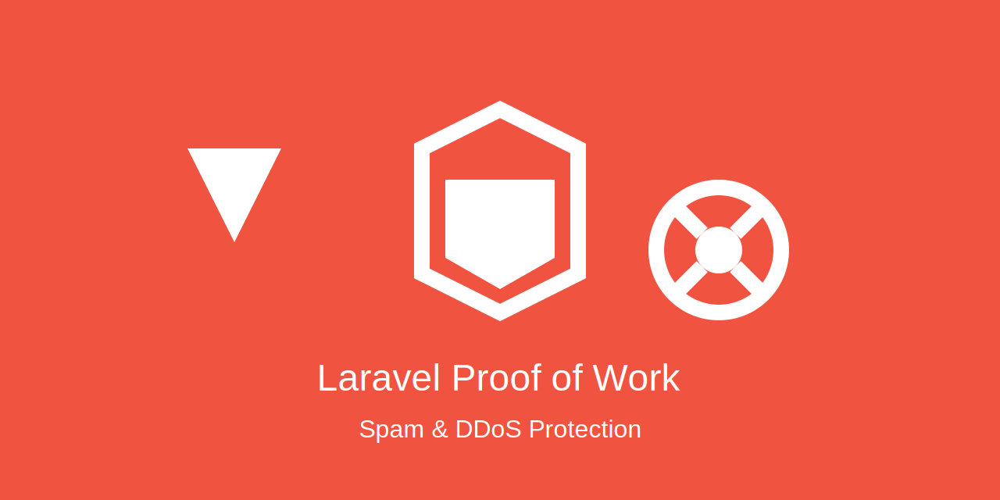

# laravel PoW "multiple frontends support"

<p align="center">
  
</p>

This package implements a Proof of Work (PoW) system for Laravel applications with support for multiple front-end frameworks including Vue.js, React, and Angular.

## Table of Contents

- [Features](#features)
- [Requirements](#requirements)
- [Installation](#installation)
- [Configuration](#configuration)
- [Usage](#usage)
  - [Backend Usage](#backend-usage)
  - [Frontend Integration](#frontend-integration)
    - [Vue.js](#vuejs)
    - [React](#react)
    - [Angular](#angular)
- [API Endpoints](#api-endpoints)
- [Contributing](#contributing)
- [License](#license)

## Features

- Configurable difficulty level for Proof of Work challenges
- Backend API for generating challenges and verifying proofs
- Frontend components for Vue.js, React, and Angular
- Easily integrable with existing Laravel applications

## Requirements

- PHP 7.4+
- Laravel 8.0+
- Node.js and NPM (for frontend components)

## Installation

1. Install the package via Composer:

```bash
composer require mohamedahmed01/laravel-pow
```

2. Publish the configuration file:

```bash
php artisan vendor:publish --provider="Mohamedahmed01\LaravelPow\LaravelPowServiceProvider" --tag="config"
```

3. Publish the frontend component for your chosen framework:

```bash
php artisan vendor:publish --provider="Mohamedahmed01\LaravelPow\LaravelPowServiceProvider" --tag="vue-component"
# Or for React:
# php artisan vendor:publish --provider="Mohamedahmed01\LaravelPow\LaravelPowServiceProvider" --tag="react-component"
# Or for Angular:
# php artisan vendor:publish --provider="Mohamedahmed01\LaravelPow\LaravelPowServiceProvider" --tag="angular-component"
```

## Configuration

After publishing the configuration file, you can adjust the PoW settings in `config/pow.php`:

```php
return [
    'difficulty' => env('POW_DIFFICULTY', 4),
    'front_end' => env('POW_FRONT_END', 'vue'), // Options: 'vue', 'react', 'angular'
];
```

You can also set these values in your `.env` file:

```
POW_DIFFICULTY=4
POW_FRONT_END=vue
```

## Usage

### Backend Usage

The package provides two main API endpoints:

1. `GET /api/pow/challenge` - Generates a new challenge
2. `POST /api/pow/verify` - Verifies a proof for a given challenge

You can use these endpoints in your application as needed.

### Frontend Integration

#### Vue.js

1. Import the component in your Vue application:

```javascript
import ProofOfWork from './components/ProofOfWork.vue';

export default {
  components: {
    ProofOfWork,
  },
  // ...
}
```

2. Use the component in your template:

```html
<template>
  <div>
    <proof-of-work></proof-of-work>
  </div>
</template>
```

#### React

1. Import the component in your React application:

```jsx
import ProofOfWork from './components/ProofOfWork';

function App() {
  return (
    <div>
      <ProofOfWork />
    </div>
  );
}
```

#### Angular

1. Import the component in your Angular module:

```typescript
import { ProofOfWorkComponent } from './components/proof-of-work.component';

@NgModule({
  declarations: [ProofOfWorkComponent],
  // ...
})
export class AppModule { }
```

2. Use the component in your template:

```html
<app-proof-of-work></app-proof-of-work>
```

## API Endpoints

### GET /api/pow/challenge

Generates a new Proof of Work challenge.

Response:
```json
{
  "challenge": "string",
  "difficulty": number
}
```

### POST /api/pow/verify

Verifies a proof for a given challenge.

Request body:
```json
{
  "challenge": "string",
  "proof": "string"
}
```

Response:
```json
{
  "status": "success" | "failure"
}
```

## Contributing

Contributions are welcome! Please feel free to submit a Pull Request.

## License

This package is open-sourced software licensed under the [MIT license](https://opensource.org/licenses/MIT).